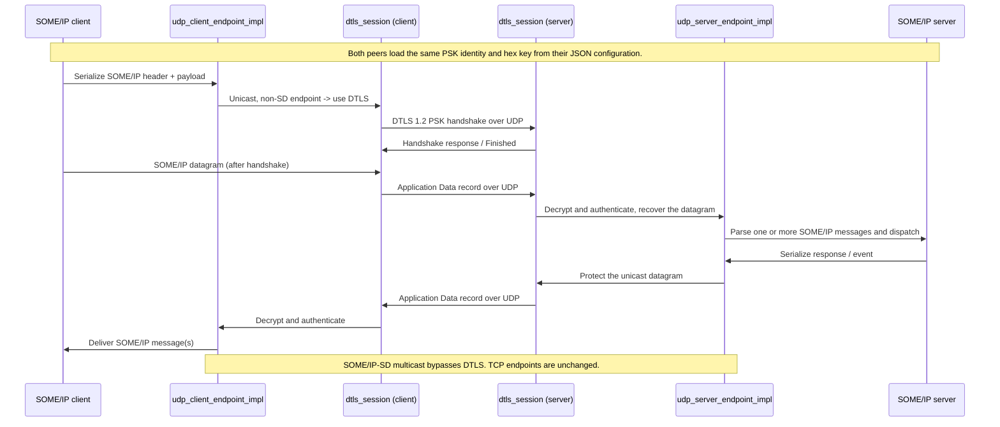

# DTLS transport for UDP endpoints

Optional DTLS 1.2 protection for UDP unicast SOME/IP traffic, authenticated with a
pre-shared key (PSK). It is off unless the `dtls` object is enabled in the vSomeIP
JSON configuration, and it changes nothing above the transport: the application and
CommonAPI message format stay SOME/IP, and DTLS wraps the UDP service datagram below
the SOME/IP parser.

The configuration keys are documented under
[DTLS](vsomeipConfiguration.md#dtls) in the configuration reference.

Measured latency, throughput and CPU against a plaintext control, plus the test
matrix, are in [dtls-benchmark.md](dtls-benchmark.md).

```json
"dtls" : {
    "enable" : true,
    "psk-identity" : "lab-peer",
    "psk-key-file" : "dtls.psk"
}
```

## Where the code applies DTLS

1. `configuration_impl::load_dtls()` reads `dtls.enable`, `psk-identity` and either
   `psk-key` or `psk-key-file`; a relative key-file path is resolved against the
   directory of the JSON file. An enabled but malformed configuration fails closed -
   the endpoints keep DTLS on and drop traffic rather than downgrading to plaintext.
2. `udp_client_endpoint_impl` selects DTLS when DTLS is enabled, the remote endpoint is
   unicast, and the remote port is not the Service Discovery port. It creates a DTLS
   client session in `connect_cbk()`, once the UDP socket is connected.
3. `udp_server_endpoint_impl` creates a DTLS server session the first time it receives a
   datagram on a non-SD unicast endpoint. Sessions live in `dtls_sessions_`, keyed by the
   peer's address and port.
4. `dtls_session` drives DTLS 1.2 in the TLS library chosen at build time (OpenSSL or
   wolfSSL, see [TLS library](#tls-library-backend)) over in-memory datagram queues. It
   negotiates the configured credentials and cipher, and leaves handshake records,
   authenticated encryption, record sequence numbers and handshake retransmission to
   the library.
5. After the handshake, outgoing serialized SOME/IP bytes are written to the session and
   the resulting records are sent as UDP datagrams. Incoming datagrams are read back
   through the session, and only authenticated plaintext reaches the normal message parser.
   While a session is missing or has failed, the endpoint drops the datagram.

## Message flow



## TLS library (backend)

Exactly one TLS library backs `dtls_session`, chosen with the CMake cache variable
`VSOMEIP_DTLS_BACKEND`. The endpoints, the configuration format and the log messages are
the same for both, and the two interoperate on the wire.

| | `openssl` (default) | `wolfssl` |
|---|---|---|
| Source | `dtls_session.cpp` | `dtls_session_wolfssl.cpp` |
| Library | OpenSSL 3 (`find_package(OpenSSL)`) | wolfSSL 5.9 (`find_package(wolfssl CONFIG)`) |
| PSK suites | `PSK-AES128-GCM-SHA256`, `ECDHE-PSK-CHACHA20-POLY1305` | the same, plus `ECDHE-PSK-AES128-GCM-SHA256` (RFC 8442) |
| Certificate suites | `ECDHE-ECDSA-AES128-GCM-SHA256` and others | the same |
| Private key | PEM file, or an OSSL_STORE URI (`pkcs11:` → TEE) through pkcs11-provider | PEM file (`file:` accepted), or an RFC 7512 `pkcs11:` URI with `module-path` and `pin-source`; the token is logged in once per process |
| Crypto accelerator | — (CPU; the devcrypto engine can be loaded through `OPENSSL_CONF`) | `"accelerator": "sa2ul"`: AES-CBC records on the TI SA2UL through `/dev/crypto` |
| HelloVerifyRequest | certificate mode | always (DTLS 1.2 server default) |
| Licence | Apache-2.0 | GPLv3, or commercial from wolfSSL Inc. |

Build with wolfSSL:

```sh
cmake -DVSOMEIP_DTLS_BACKEND=wolfssl -Dwolfssl_DIR=<prefix>/lib/cmake/wolfssl ..
```

wolfSSL must be configured with these options. `dtls_session_wolfssl.cpp` stops the build
with `#error` when one of the defines is missing, because a mismatch between the library
and its user changes struct layouts without any other symptom:

```sh
./configure --enable-dtls --enable-psk --enable-dtls-mtu --enable-opensslextra \
    --enable-curve25519 --enable-supportedcurves --enable-sp --enable-sp-asm --enable-armasm \
    --enable-cryptocb --enable-cryptocbutils=free --enable-pkcs11 \
    CFLAGS="-DWOLFSSL_ALWAYS_VERIFY_CB -DWOLFSSL_HOSTNAME_VERIFY_ALT_NAME_ONLY -DWOLFSSL_STATIC_PSK"
```

`--enable-armasm` is for aarch64 (ARMv8 AES/SHA/PMULL instructions); use
`--enable-aesni --enable-intelasm` on x86_64 instead.

| Option | Why |
|---|---|
| `--enable-dtls-mtu` | Handshake flights are cut at 1200 bytes, then the MTU is raised to 1472 (one Ethernet frame minus IPv4 and UDP headers), so a SOME/IP message is one record in one datagram and never IP-fragmented (wolfSSL limits each record to the MTU) |
| `--enable-opensslextra` | X.509 accessors for the time-floor expiry check |
| `WOLFSSL_ALWAYS_VERIFY_CB` | The verify callback sees every certificate: time floor, rejection reason |
| `WOLFSSL_HOSTNAME_VERIFY_ALT_NAME_ONLY` | The pinned peer name must be in the SAN, never only in the CN |
| `WOLFSSL_STATIC_PSK` | Plain PSK suites, including the default `PSK-AES128-GCM-SHA256`; wolfSSL builds only (EC)DHE-PSK otherwise |
| `--enable-cryptocb --enable-cryptocbutils=free` | Optional. The vsomeip crypto device: SA2UL offload, and the free hook that closes the cryptodev session of an AES key |
| `--enable-pkcs11` | Optional. Private keys in a PKCS#11 token (OP-TEE, TrustKernel, HSM) |

wolfSSL-specific behaviour handled in `dtls_session_wolfssl.cpp`:

- **Retransmission storm.** wolfSSL resends its last flight whenever the peer resends one
  (RFC 6347 4.2.4). Two wolfSSL peers that cannot finish a handshake, for example with
  different keys, then answer each other at line rate (79,015 datagrams in 2.5 s in the
  unit test). The session limits such reactive resends to one per second; new flights and
  timer-driven retransmissions are never held back, so a lost final flight still recovers.
- **Rejection reasons.** wolfSSL error codes are mapped to the OpenSSL wording
  (`unable to get local issuer certificate`, `certificate has expired`, `hostname mismatch`,
  `unsuitable certificate purpose`, ...) so logs and the negative tests read the same.
- **Trust anchor under an untrusted clock.** wolfSSL checks a CA's dates while loading it;
  with the clock behind the time floor it is loaded with `WOLFSSL_LOAD_FLAG_DATE_ERR_OKAY`
  and judged against the floor like the rest of the chain. Without this, an ECU whose clock
  starts at 1970 refuses its own 2026 CA and certificate mode never starts.
- **Cookie.** wolfSSL's HMAC cookie is bound to the peer address passed to
  `wolfSSL_dtls_set_peer()`; a ClientHello carrying the cookie of another address gets a
  new HelloVerifyRequest, never the certificate flight.

Licensing: vsomeip is MPL-2.0. Linking wolfSSL under GPLv3 makes the combined binary
subject to the GPL; a product shipping the wolfSSL backend needs a commercial wolfSSL
licence unless it is released under GPLv3.

For a cross-build, provide the chosen library's headers and libraries for the target
architecture (SDK sysroot or install prefix) before running CMake. OpenSSL is usually
part of the target image; wolfSSL has to be shipped with the application.

### Hardware: SA2UL accelerator and PKCS#11 keys (wolfSSL backend)

The wolfSSL backend registers one wolfSSL crypto-callback device per process
(`dtls_wolfssl_device.cpp`) and attaches it to the sessions that need it. Everything the
device does not handle falls back to wolfSSL's own CPU code.

- **`"accelerator": "sa2ul"`** sends AES-CBC record encryption to the TI SA2UL/SA3UL
  through cryptodev (`/dev/crypto`). At start the device opens a probe session and reads
  which kernel driver serves `cbc(aes)`; anything other than `*-sa2ul` disables the
  offload with a warning instead of routing AES through a syscall to the CPU. One
  cryptodev session per AES key is kept until wolfSSL frees the key. Requests of 64 KiB
  or more stay on the CPU (the SA2UL driver would hand them back anyway).
  Only the AES-CBC part of a CBC suite is offloaded (`PSK-AES128-CBC-SHA256`,
  `ECDHE-PSK-AES128-CBC-SHA256`, `ECDHE-ECDSA-AES128-CBC-SHA256`): the SA2UL drivers
  in the TI SDK kernels checked (6.6 and 6.12) register no GCM, and HMAC through
  cryptodev falls back to the CPU. With a GCM suite the option has no effect and says so.
  A CBC-SHA256 record holds less than a plain UDP datagram (1407 against 1416 bytes);
  see [Message size](#message-size-and-someip-tp) for how the endpoints handle that.
  The option is a performance choice, not a security one: without a usable SA2UL the
  session runs AES on the CPU and logs why.
- **`pkcs11:` private key**: `private-key` takes an RFC 7512 URI,
  `pkcs11:token=<token>;object=<label>;type=private?module-path=<lib>&pin-source=file:<pin file>`.
  The PIN file must not be accessible by group or others; a PIN in the URI
  (`pin-value`) is refused. The token is opened and logged in once per process; only
  ECDSA signatures with that key go to the token, ephemeral ECDHE keys and peer
  signature checks stay on the CPU. A missing module, token or PIN is an error: the
  session is not created.

### Unit test

### Message size and SOME/IP-TP

One SOME/IP datagram is sent as one DTLS record in one UDP datagram of at most 1472
bytes (Ethernet 1500 - IPv4 20 - UDP 8), so DTLS never causes IP fragmentation. How much
SOME/IP fits in that record depends on the cipher suite:

| Suite | Largest SOME/IP datagram per record | Fits 1416 (payload 1400)? |
|---|---:|---|
| AES-GCM, AES-CCM | 1435 | yes |
| AES-CCM8, ChaCha20-Poly1305 | 1443 | yes |
| AES-CBC with SHA-1 | 1407 (encrypt-then-MAC; 1419 without) | no |
| AES-CBC with SHA-256 (all suites the SA2UL runs) | **1407** | no |
| AES-CBC with SHA-384 | 1391 | no |

`dtls::max_message_size()` (`dtls_record_limit.cpp`) computes this for the configured
`cipher` list, taking the smallest value of all suites in the list so the result holds
whichever one the handshake picks. Each UDP endpoint that uses DTLS keeps it as its
send limit and logs it once:

```
DTLS: one record holds at most 1407 bytes of SOME/IP with ECDHE-ECDSA-AES128-SHA256; larger messages use SOME/IP-TP where it is configured
```

- **Methods with `someip-tp`:** a message above the record limit is segmented even
  when it is not above the UDP limit (1416). This closes the gap of 1392-1400 byte
  payloads with CBC-SHA256, which previously fit UDP, were not segmented and were then
  refused by DTLS. `max-segment-length` is lowered when needed so that every segment
  fits one record (1376 for CBC-SHA256 and CBC-SHA1, 1360 for CBC-SHA384; a warning
  names the change once).
- **Methods without `someip-tp`:** unchanged. A message above the record limit is
  dropped (wolfSSL) with an error naming the method's fix: enable SOME/IP-TP for it or
  keep its messages smaller. The session continues.
- **Trains (nPDU batching):** several small messages are packed into one datagram only
  up to the record limit, so batching never builds a datagram DTLS has to refuse.
- **Receiving** is not affected: received datagrams are still checked against 1416,
  whatever suite the peer negotiated.

With AES-GCM or ChaCha20 nothing changes, since every SOME/IP datagram fits one record.

### Endpoint data path

After the handshake the UDP endpoints treat a DTLS record like a plaintext datagram:

- **Send:** `send_queued_dtls_unlocked()` (server) / `send_queued_dtls()` (client) call
  `dtls_session::seal()`, which encrypts the SOME/IP datagram and returns the record. The
  endpoint puts it on its socket itself, and the send completion calls `send_cbk()` directly,
  one io_context hop as on the plaintext path. Before, the record went through the session's
  send handler, a post (the caller holds the socket lock), `async_send_to` and a second post
  to `send_cbk()`.
- **Receive:** `dtls_session::feed(datagram, plaintext_out)` returns the authenticated
  messages, and the endpoint parses them in the same receive context (server: io_context,
  client: its strand), handing the buffer on without another copy. Before, the plaintext
  handler posted to the io_context and copied the message again.
- `wolfSSL_read()` reads into a buffer the session keeps (16 KiB, one record's maximum
  plaintext), instead of allocating and zeroing 64 KiB twice per record.
- Handshake flights, alerts and retransmissions still go out through the send handler.
  Errors keep their contract: a message `seal()` refuses (record limit, failed session) is
  reported to `send_cbk()` as a failed send.

Measured on an AM62A (A53, loaded), old and new build alternately: RTT -3 to -8 % and
board CPU per request -3 to -7 % in every DTLS mode, plaintext unchanged. Context switches
per request did not change, so the hops were cheap on a busy io thread; most of the cost per
message is vsomeip itself.

### Where the time goes: VSOMEIP_DTLS_STATS

`VSOMEIP_DTLS_STATS=<seconds>` (wolfSSL backend) logs, every `<seconds>`, the cost of the
records of all sessions of the process. It is off by default and then costs one test per
record:

```
DTLS stats 1.0 s: send 750 records 133.4 us each (cpu 112.5) | receive 749 records 97.2 us each (cpu 85.8) + deliver 10.8 us | SA2UL 0 calls 0.0 us each (0.00 per record)
```

| Field | Meaning |
|---|---|
| send | `wolfSSL_write()` of one record: encryption and MAC, plus the SA2UL when it is used |
| receive | from datagram to plaintext: MAC check and decryption |
| (cpu ...) | CPU time of the thread in that step; wall time minus CPU time is waiting (for the CPU on a loaded node, or for the SA2UL's DMA) |
| deliver | handing the plaintext to the endpoint (queued to its io_context) |
| SA2UL | `CIOCCRYPT` calls and their duration; one call per record |

`test/unit_tests/dtls_session_tests` runs a client and a server `dtls_session` against
each other in one process, through queues the test controls, against whichever backend
the library was built with (`-DGTEST_ROOT=...`, target `unit_tests_dtls_session_tests`).
It covers the PSK and certificate handshakes, the 1416-byte single-record limit, loss and
retransmission of every flight, replayed, tampered and garbage records, the cookie, and
every certificate rejection, including the untrusted-clock rules and the case of a
clock years behind the certificates, and the record limit of every suite against the
TLS library itself (a message of the limit fits one 1472-byte datagram; with wolfSSL
one byte more is refused). On x86_64, 41 cases pass with OpenSSL and 43 with wolfSSL
(one more, the SA2UL interoperability case, needs the hardware and is skipped).

## TLS for reliable (TCP) endpoints

With `"tls": { "enable": true }` the TCP service endpoints carry TLS (wolfSSL backend
only; the OpenSSL backend refuses it and the connection is closed). The credentials are
the ones of the `"dtls"` object (mode, certificate, key or `pkcs11:` URI, CA, peers,
PSKs, accelerator); `"dtls": { "enable": false, ... }` keeps UDP in plaintext while TCP
uses TLS. `"version"` is `"1.2"` (default, same cipher suites as DTLS, so the SA2UL can
run AES-CBC) or `"1.3"` (`TLS13-AES128-GCM-SHA256` unless `"cipher"` says otherwise).

```json
"tls" : { "enable" : true, "version" : "1.2" }
```

- **Session:** the same `dtls_session` with `credentials::stream_` set: TLS method of the
  configured version, no cookie, no MTU and no retransmission timer (TCP does that);
  input and output are stream chunks, read partially as wolfSSL asks for bytes.
- **Client** (`tcp_client_endpoint_impl`): once TCP is connected,
  `on_transport_connected()` creates the session and sends the ClientHello. Messages
  queued meanwhile wait and are sent when the handshake completes.
- **Server** (`tcp_server_endpoint_impl::connection`): one session per accepted
  connection, created before the first read; the expected certificate name is looked up
  by the client's address. A connection whose session cannot be created is closed.
- **Writes:** handshake data and records go through one ordered queue per connection
  (`tls::writer`), since TLS records must reach the stream in order and a socket takes one
  write at a time. A message larger than 16 KiB becomes several records, written as one
  chunk.
- **Reads:** ciphertext is read into its own buffer; the plaintext is appended to the
  endpoint's receive buffer and the unchanged SOME/IP stream parser runs on it.
- **Failures:** a refused handshake or a bad record ends the connection (a TLS stream
  cannot skip a record); the endpoint reconnects. There is never a plaintext fallback:
  with `"tls"` on, a connection without a ready session sends nothing.
- Magic cookies are not used with TLS: the record layer already detects corruption.

## Scope and limitations

- Protected: UDP unicast service data on configured service endpoints; with `"tls"`, TCP
  service data.
- Not protected: SOME/IP Service Discovery and any other multicast traffic; TCP unless
  `"tls"` is enabled.
- Authentication: a PSK (node-wide, or one key per peer pair through `peers`), or X.509
  certificates with `"mode": "certificate"` — see [DTLS with X.509 certificates](dtls-certificate.md).
  Keys can come from a file, inline, or a `key-command`; certificate private keys also
  from an OpenSSL store URI such as `pkcs11:`. Treat the bundled lab PSK and lab PKI as
  test credentials only.
- Version is pinned to DTLS 1.2. The cipher defaults to `PSK-AES128-GCM-SHA256` (no
  forward secrecy) in PSK mode and `ECDHE-ECDSA-AES128-GCM-SHA256` in certificate mode;
  `ECDHE-PSK-CHACHA20-POLY1305` adds forward secrecy to PSK mode.
- Every peer on a protected endpoint needs this build and a matching configuration. A
  plaintext peer cannot talk to a DTLS endpoint; there is no plaintext downgrade.
- Sessions are keyed by the peer's address and port. A client that restarts while keeping
  its configured ports reuses the server's existing session, so no new handshake appears
  on the wire until the server side drops it.
- Not yet addressed: load and performance measurements, reconnect and endpoint churn
  under packet loss, session resource limits, and how to protect discovery.

## Verifying on the wire

Capture on the interface carrying the service traffic and decode the UDP service ports
as DTLS. Handshake datagrams start with `16 fe fd` (content type 22, DTLS 1.2) and
application data with `17 fe fd` (content type 23); the SOME/IP-SD port stays decodable
as SOME/IP/SD. The server logs `DTLS: PSK handshake completed` per endpoint at
`VSOMEIP_INFO`, so a configuration logging at level `error` hides those lines.

This transport has been exercised end to end between two hosts on UDP unicast service
endpoints, with the PSK handshakes completing and every service datagram carrying
complete DTLS records.
