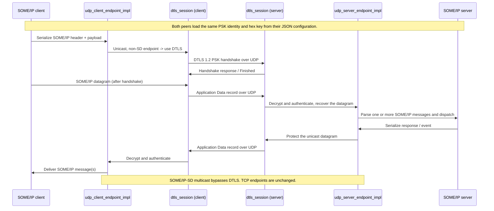

# DTLS transport for UDP endpoints

Optional DTLS 1.2 protection for UDP unicast SOME/IP traffic, authenticated with a
pre-shared key (PSK). It is off unless the `dtls` object is enabled in the vSomeIP
JSON configuration, and it changes nothing above the transport: the application and
CommonAPI message format stay SOME/IP, and DTLS wraps the UDP service datagram below
the SOME/IP parser.

The configuration keys are documented under
[DTLS](vsomeipConfiguration.md#dtls) in the configuration reference.

Measured latency, throughput and CPU against a plaintext control, plus the test
matrix, are in [dtls-benchmark.md](dtls-benchmark.md).

```json
"dtls" : {
    "enable" : true,
    "psk-identity" : "lab-peer",
    "psk-key-file" : "dtls.psk"
}
```

## Where the code applies DTLS

1. `configuration_impl::load_dtls()` reads `dtls.enable`, `psk-identity` and either
   `psk-key` or `psk-key-file`; a relative key-file path is resolved against the
   directory of the JSON file. An enabled but malformed configuration fails closed -
   the endpoints keep DTLS on and drop traffic rather than downgrading to plaintext.
2. `udp_client_endpoint_impl` selects DTLS when DTLS is enabled, the remote endpoint is
   unicast, and the remote port is not the Service Discovery port. It creates a DTLS
   client session in `connect_cbk()`, once the UDP socket is connected.
3. `udp_server_endpoint_impl` creates a DTLS server session the first time it receives a
   datagram on a non-SD unicast endpoint. Sessions live in `dtls_sessions_`, keyed by the
   peer's address and port.
4. `dtls_session` drives DTLS 1.2 in the TLS library chosen at build time (OpenSSL or
   wolfSSL, see [TLS library](#tls-library-backend)) over in-memory datagram queues. It
   negotiates the configured credentials and cipher, and leaves handshake records,
   authenticated encryption, record sequence numbers and handshake retransmission to
   the library.
5. After the handshake, outgoing serialized SOME/IP bytes are written to the session and
   the resulting records are sent as UDP datagrams. Incoming datagrams are read back
   through the session, and only authenticated plaintext reaches the normal message parser.
   While a session is missing or has failed, the endpoint drops the datagram.

## Message flow



## TLS library (backend)

Exactly one TLS library backs `dtls_session`, chosen with the CMake cache variable
`VSOMEIP_DTLS_BACKEND`. The endpoints, the configuration format and the log messages are
the same for both, and the two interoperate on the wire.

| | `openssl` (default) | `wolfssl` |
|---|---|---|
| Source | `dtls_session.cpp` | `dtls_session_wolfssl.cpp` |
| Library | OpenSSL 3 (`find_package(OpenSSL)`) | wolfSSL 5.9 (`find_package(wolfssl CONFIG)`) |
| PSK suites | `PSK-AES128-GCM-SHA256`, `ECDHE-PSK-CHACHA20-POLY1305` | the same, plus `ECDHE-PSK-AES128-GCM-SHA256` (RFC 8442) |
| Certificate suites | `ECDHE-ECDSA-AES128-GCM-SHA256` and others | the same |
| Private key | PEM file, or an OSSL_STORE URI (`pkcs11:` → TEE) | PEM file (`file:` prefix accepted); `pkcs11:` is refused |
| HelloVerifyRequest | certificate mode | always (DTLS 1.2 server default) |
| Licence | Apache-2.0 | GPLv3, or commercial from wolfSSL Inc. |

Build with wolfSSL:

```sh
cmake -DVSOMEIP_DTLS_BACKEND=wolfssl -Dwolfssl_DIR=<prefix>/lib/cmake/wolfssl ..
```

wolfSSL must be configured with these options. `dtls_session_wolfssl.cpp` stops the build
with `#error` when one of the defines is missing, because a mismatch between the library
and its user changes struct layouts without any other symptom:

```sh
./configure --enable-dtls --enable-psk --enable-dtls-mtu --enable-opensslextra \
    --enable-curve25519 --enable-supportedcurves --enable-sp --enable-sp-asm --enable-armasm \
    CFLAGS="-DWOLFSSL_ALWAYS_VERIFY_CB -DWOLFSSL_HOSTNAME_VERIFY_ALT_NAME_ONLY -DWOLFSSL_STATIC_PSK"
```

`--enable-armasm` is for aarch64 (ARMv8 AES/SHA/PMULL instructions); use
`--enable-aesni --enable-intelasm` on x86_64 instead.

| Option | Why |
|---|---|
| `--enable-dtls-mtu` | Handshake flights are cut at 1200 bytes, then the MTU is raised to 1500 so a 1416-byte SOME/IP message stays one record in one datagram (wolfSSL limits each record to the MTU) |
| `--enable-opensslextra` | X.509 accessors for the time-floor expiry check |
| `WOLFSSL_ALWAYS_VERIFY_CB` | The verify callback sees every certificate: time floor, rejection reason |
| `WOLFSSL_HOSTNAME_VERIFY_ALT_NAME_ONLY` | The pinned peer name must be in the SAN, never only in the CN |
| `WOLFSSL_STATIC_PSK` | Plain PSK suites, including the default `PSK-AES128-GCM-SHA256`; wolfSSL builds only (EC)DHE-PSK otherwise |

wolfSSL-specific behaviour handled in `dtls_session_wolfssl.cpp`:

- **Retransmission storm.** wolfSSL resends its last flight whenever the peer resends one
  (RFC 6347 4.2.4). Two wolfSSL peers that cannot finish a handshake, for example with
  different keys, then answer each other at line rate (79,015 datagrams in 2.5 s in the
  unit test). The session limits such reactive resends to one per second; new flights and
  timer-driven retransmissions are never held back, so a lost final flight still recovers.
- **Rejection reasons.** wolfSSL error codes are mapped to the OpenSSL wording
  (`unable to get local issuer certificate`, `certificate has expired`, `hostname mismatch`,
  `unsuitable certificate purpose`, ...) so logs and the negative tests read the same.
- **Trust anchor under an untrusted clock.** wolfSSL checks a CA's dates while loading it;
  with the clock behind the time floor it is loaded with `WOLFSSL_LOAD_FLAG_DATE_ERR_OKAY`
  and judged against the floor like the rest of the chain. Without this, an ECU whose clock
  starts at 1970 refuses its own 2026 CA and certificate mode never starts.
- **Cookie.** wolfSSL's HMAC cookie is bound to the peer address passed to
  `wolfSSL_dtls_set_peer()`; a ClientHello carrying the cookie of another address gets a
  new HelloVerifyRequest, never the certificate flight.

Licensing: vsomeip is MPL-2.0. Linking wolfSSL under GPLv3 makes the combined binary
subject to the GPL; a product shipping the wolfSSL backend needs a commercial wolfSSL
licence unless it is released under GPLv3.

For a cross-build, provide the chosen library's headers and libraries for the target
architecture (SDK sysroot or install prefix) before running CMake. OpenSSL is usually
part of the target image; wolfSSL has to be shipped with the application.

### Unit test

`test/unit_tests/dtls_session_tests` runs a client and a server `dtls_session` against
each other in one process, through queues the test controls, against whichever backend
the library was built with (`-DGTEST_ROOT=...`, target `unit_tests_dtls_session_tests`).
It covers the PSK and certificate handshakes, the 1416-byte single-record limit, loss and
retransmission of every flight, replayed, tampered and garbage records, the cookie, and
every certificate rejection, including the untrusted-clock rules and the case of a
clock years behind the certificates. The same 33 cases pass
on both backends on x86_64 and with wolfSSL on an aarch64 target whose clock is at 1970.

## Scope and limitations

- Protected: UDP unicast service data on configured service endpoints.
- Not protected: SOME/IP Service Discovery, any other multicast traffic, and TCP.
- Authentication: a PSK (node-wide, or one key per peer pair through `peers`), or X.509
  certificates with `"mode": "certificate"` — see [DTLS with X.509 certificates](dtls-certificate.md).
  Keys can come from a file, inline, or a `key-command`; certificate private keys also
  from an OpenSSL store URI such as `pkcs11:`. Treat the bundled lab PSK and lab PKI as
  test credentials only.
- Version is pinned to DTLS 1.2. The cipher defaults to `PSK-AES128-GCM-SHA256` (no
  forward secrecy) in PSK mode and `ECDHE-ECDSA-AES128-GCM-SHA256` in certificate mode;
  `ECDHE-PSK-CHACHA20-POLY1305` adds forward secrecy to PSK mode.
- Every peer on a protected endpoint needs this build and a matching configuration. A
  plaintext peer cannot talk to a DTLS endpoint; there is no plaintext downgrade.
- Sessions are keyed by the peer's address and port. A client that restarts while keeping
  its configured ports reuses the server's existing session, so no new handshake appears
  on the wire until the server side drops it.
- Not yet addressed: load and performance measurements, reconnect and endpoint churn
  under packet loss, session resource limits, and how to protect discovery.

## Verifying on the wire

Capture on the interface carrying the service traffic and decode the UDP service ports
as DTLS. Handshake datagrams start with `16 fe fd` (content type 22, DTLS 1.2) and
application data with `17 fe fd` (content type 23); the SOME/IP-SD port stays decodable
as SOME/IP/SD. The server logs `DTLS: PSK handshake completed` per endpoint at
`VSOMEIP_INFO`, so a configuration logging at level `error` hides those lines.

This transport has been exercised end to end between two hosts on UDP unicast service
endpoints, with the PSK handshakes completing and every service datagram carrying
complete DTLS records.
