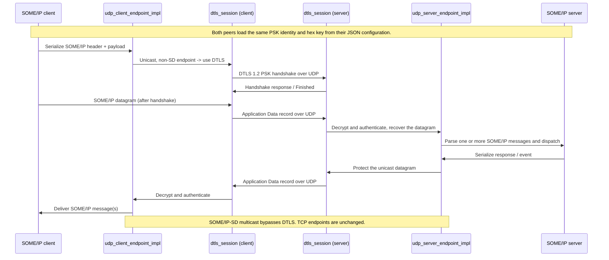

# DTLS transport for UDP endpoints

Optional DTLS 1.2 protection for UDP unicast SOME/IP traffic, authenticated with a
pre-shared key (PSK). It is off unless the `dtls` object is enabled in the vSomeIP
JSON configuration, and it changes nothing above the transport: the application and
CommonAPI message format stay SOME/IP, and DTLS wraps the UDP service datagram below
the SOME/IP parser.

The configuration keys are documented under
[DTLS](vsomeipConfiguration.md#dtls) in the configuration reference.

Measured latency, throughput and CPU against a plaintext control, plus the test
matrix, are in [dtls-benchmark.md](dtls-benchmark.md).

```json
"dtls" : {
    "enable" : true,
    "psk-identity" : "lab-peer",
    "psk-key-file" : "dtls.psk"
}
```

## Where the code applies DTLS

1. `configuration_impl::load_dtls()` reads `dtls.enable`, `psk-identity` and either
   `psk-key` or `psk-key-file`; a relative key-file path is resolved against the
   directory of the JSON file. An enabled but malformed configuration fails closed -
   the endpoints keep DTLS on and drop traffic rather than downgrading to plaintext.
2. `udp_client_endpoint_impl` selects DTLS when DTLS is enabled, the remote endpoint is
   unicast, and the remote port is not the Service Discovery port. It creates a DTLS
   client session in `connect_cbk()`, once the UDP socket is connected.
3. `udp_server_endpoint_impl` creates a DTLS server session the first time it receives a
   datagram on a non-SD unicast endpoint. Sessions live in `dtls_sessions_`, keyed by the
   peer's address and port.
4. `dtls_session` drives OpenSSL DTLS 1.2 over a datagram BIO. It negotiates the
   configured identity and key with the fixed `PSK-AES128-GCM-SHA256` cipher, and leaves
   handshake records, authenticated encryption, record sequence numbers and handshake
   retransmission to OpenSSL.
5. After the handshake, outgoing serialized SOME/IP bytes go through `SSL_write_ex()` and
   the resulting records are sent as UDP datagrams. Incoming datagrams go through
   `SSL_read_ex()`, and only authenticated plaintext reaches the normal message parser.
   While a session is missing or has failed, the endpoint drops the datagram.

## Message flow



## Build dependency

OpenSSL development headers and libraries are required to build, and the matching
OpenSSL runtime must be present on every target. For a cross-build, provide the target
architecture's OpenSSL headers and libraries in the SDK sysroot or the configured
install prefix before running CMake.

## Scope and limitations

- Protected: UDP unicast service data on configured service endpoints.
- Not protected: SOME/IP Service Discovery, any other multicast traffic, and TCP.
- Authentication: one shared PSK identity and secret. There is no X.509 mode and no
  per-device key provisioning here. Treat the shared PSK as a lab credential; a
  deployed vehicle needs per-device credentials and a certificate based identity design.
- Cipher and version are pinned to DTLS 1.2 and `PSK-AES128-GCM-SHA256`.
- Every peer on a protected endpoint needs this build and a matching configuration. A
  plaintext peer cannot talk to a DTLS endpoint; there is no plaintext downgrade.
- Sessions are keyed by the peer's address and port. A client that restarts while keeping
  its configured ports reuses the server's existing session, so no new handshake appears
  on the wire until the server side drops it.
- Not yet addressed: load and performance measurements, reconnect and endpoint churn
  under packet loss, session resource limits, and how to protect discovery.

## Verifying on the wire

Capture on the interface carrying the service traffic and decode the UDP service ports
as DTLS. Handshake datagrams start with `16 fe fd` (content type 22, DTLS 1.2) and
application data with `17 fe fd` (content type 23); the SOME/IP-SD port stays decodable
as SOME/IP/SD. The server logs `DTLS: PSK handshake completed` per endpoint at
`VSOMEIP_INFO`, so a configuration logging at level `error` hides those lines.

This transport has been exercised end to end between two hosts on UDP unicast service
endpoints, with the PSK handshakes completing and every service datagram carrying
complete DTLS records.
